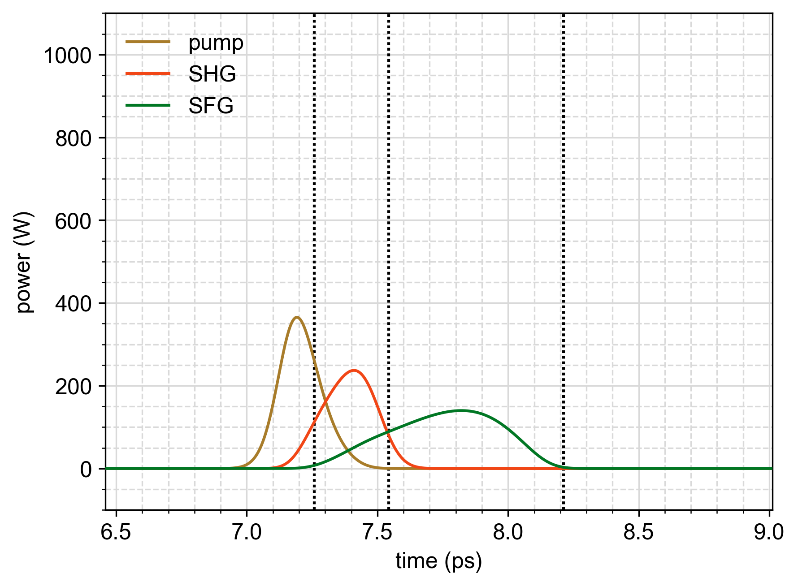

# pulseprop — Nonlinear optical pulse propagation

Time‑domain simulations for second‑order (χ²) nonlinear optics: second‑harmonic generation (SHG), sum‑frequency generation (SFG), cascaded tripling, general three‑wave mixing, and optical parametric amplification (OPA). Uses Sellmeier dispersion and integrates the coupled envelopes along the crystal.

---

## Install

Requires Python ≥ 3.9, NumPy, and SciPy, plus two external libraries:

```bash
pip install numpy scipy
pip install git+https://github.com/decoherer/wavedata
pip install git+https://github.com/decoherer/sellmeier
```

- **wavedata** supplies the `Wave` container and plotting helpers.
- **sellmeier** supplies refractive index models, group velocity, and QPM utilities.

---

## Quick start

```python
from pulseprop import triplerpulseprop

# 0.2 ps pump at 1555 nm, 1 mm crystal, SHG η1=30 %/W/cm², SFG η2=250 %/W/cm²
_ = triplerpulseprop(τ=.2, L=1, P1=1000,
                     η1=30, η2=250, λ1=1555,
                     sell='mglnridgewg', plot=1)
```

Run `python pulseprop.py` for more demos.

---

## Example



Plot of pump, SHG, and SFG powers vs time at the output of a 1mm length MgLN ridge waveguide with interleaved QPM poling for both 1555nm SHG doubling and 1555nm+777.5nm SFG tripling given 0.2ps Gaussian FWHM input pulse with 1000W peak power at 1555nm. This figure is produced by:

```python
triplerpulseprop(τ=.2, L=1, P1=1000, η1=30, η2=250,
                 λ1=1555, sell='mglnridgewg', plot=1)
```

Dashed lines mark group‑delay times $t=L/v_g(\lambda_j)$ for $\lambda_1$, $\lambda_2=\lambda_1/2$, and $\lambda_3=\lambda_1/3$.

---

## Units and conventions

- Time $t$: picoseconds.
- Length $L$: millimeters.
- Power $P$: watts. Peak power of a Gaussian envelope.
- Pulse width $τ$: full width at half maximum (FWHM) of **power**.
- Wavelengths $\lambda$: nanometers.
- Material model: `sell` selects a dataset key from `sellmeier`.
- Quasi‑phase matching: `Λ` in micrometers (µm). If provided, the code applies a QPM mismatch term $k_g$.
- Nonlinear “efficiency” parameters $η$ are in %/W/cm². Internally converted to a coupling constant that scales with effective $d_\mathrm{eff}$, modal overlap, and normalization.

---

## API

### `singlepulseprop(τ, L, P, λ0=1550, sell='ktp', dt=0.005, plot=False)`

Linear propagation sanity check. Propagates a Gaussian at $\lambda_0$ and a copy at $\lambda_0/2$ through a dispersive medium. No nonlinear coupling. Returns the output field envelopes as `Wave` objects. Optional plot overlays group‑delay markers.

---

### `shgpulseprop(τ, L, P, η=0, λ0=1550, sell='ktp', Type='zzz', Λ=None, dt=0.005, d=None, rtol=1e-3, atol=1e-6, plot=False)`

Second‑harmonic generation of a single Gaussian pump. Two coupled envelopes: fundamental $\lambda_1=\lambda_0$ and second harmonic $\lambda_3=\lambda_0/2$.

- `η` (%/W/cm²): SHG coupling strength.
- `Λ` (µm): optional QPM period override.
- `d(z)`: optional complex longitudinal poling profile (defaults to 1).

Returns `A1, A3` as `Wave` objects at $z=L$.

---

### `sfgpulseprop(τ, L, P1, P2, η=0, λ1=1550, λ2=775, sell='ktp', Type='zzz', Λ=None, dt=0.005, rtol=1e-3, atol=1e-6, plot=False)`

Sum‑frequency generation of two Gaussian inputs at $\lambda_1$ and $\lambda_2$, producing $\lambda_3 = (1/\lambda_1 + 1/\lambda_2)^{-1}$. Three coupled envelopes with dispersion and optional QPM. Returns `A1, A2, A3` at $z=L$. Plots include dashed lines at $L/v_g(\lambda_j)$.

---

### `triplerpulseprop(τ, L, P1, η1=0, η2=0, λ1=1550, sell='ktp', Type='zzz', Λ1=None, Λ2=None, d1=None, d2=None, nres=40, rtol=1e-3, atol=1e-6, plot=False)`

Cascaded tripling: SHG $\lambda_1+\lambda_1 → \lambda_2=\lambda_1/2$ then SFG $\lambda_1+\lambda_2 → \lambda_3=\lambda_1/3$. Independent SHG and SFG couplings `η1`, `η2`. Optional distinct QPM periods `Λ1`, `Λ2` and poling profiles `d1(z)`, `d2(z)`. Returns `A0, A1, A2, A3` where `A0` is the input pump and `A1..A3` are outputs at $z=L$. The demo that creates the figure uses this routine.

---

### `threewavepulseprop(P1=0, P2=0.01, P3=5000, τ1=50, τ2=50, τ3=0.5, L=1, η=600, λ1=920, λ2=1170, sell='mglnridgewg', Type='zzz', Λ=None, d=None, dt=0.01, rtol=1e-3, atol=1e-6, plot=False)`

General three‑wave mixing engine. Covers SFG or DFG by sign conventions. You set peak powers and durations for each band $(\lambda_1, \lambda_2, \lambda_3)$ with $\lambda_3=(1/\lambda_1 + 1/\lambda_2)^{-1}$. Includes dispersion, optional QPM, and a longitudinal `d(z)` profile. Returns `A1, A2, A3, e1, e2, e3` (outputs at $z=L$ and the corresponding inputs).

---

### `opapulseprop(P3=5e3, P2=0.01, τ3=0.5, τ2=50, L=1, η=600, λ3=515, λ2=1170, sell='mglnridgewg', Type='zzz', Λ=None, d=None, dt=0.01, rtol=1e-3, atol=1e-6, plot=False)`

OPA convenience wrapper built on `threewavepulseprop`. You pass the pump (`P3, τ3, λ3`) and seed (`P2, τ2, λ2`); the idler wavelength is computed from $1/\lambda_1 = 1/\lambda_3 - 1/\lambda_2$. Returns `A1, A2, A3, e2, e3`.

---

### `temporal2spectral(A, λ0, vsfreq=False, correctphaseramp=False, plot=False, logplot=True)`

Fourier transform utility mapping a time‑domain envelope `A(t)` to a spectrum `B(λ)` or `B(f)` with consistent energy scaling. Useful for verifying time–bandwidth products and visualizing spectra. If `vsfreq=True`, returns `B(f)`; otherwise returns `B(λ)`.

# Model Summary

## Fields and normalization

The code propagates slowly varying complex envelopes $A_j(z,t)$ for bands $j \in \{1,2,3\}$ centered at carrier frequencies $\omega_j = 2\pi c / \lambda_j$.  
The physical field is:

$$E_j(z,t) = \mathrm{Re}\{ A_j(z,t) e^{i(k_j z - \omega_j t)} \}, \quad k_j = k(\omega_j)$$

Envelopes are normalized so that instantaneous power is $P_j(z,t) = |A_j(z,t)|^2$ in watts.  
Time $t$ is in picoseconds. Propagation distance $z$ is in millimeters.

---

## Linear dispersion

Material dispersion comes from the Sellmeier refractive index $n(\lambda)$.  
The wavenumber is $k(\omega) = n(\omega)\, \omega / c$.

Linear operator in frequency domain:

$$\partial_z \tilde{A}_j(z,\Omega) = i\, \Phi_j(\Omega)\, \tilde{A}_j(z,\Omega)$$

with

$$\Phi_j(\Omega) = k(\omega_j + \Omega) - k(\omega_j)$$

Expanding $\Phi_j(\Omega)$ includes all orders of dispersion:

$$\Phi_j(\Omega) = k'_j\,\Omega + \tfrac{1}{2}k''_j\,\Omega^2 + \tfrac{1}{6}k^{(3)}_j\,\Omega^3 + \cdots, \quad v_{g,j} = 1/k'_j$$

---

## Nonlinear $\chi^{(2)}$ coupling

Coupling uses the standard three‑wave slowly‑varying‑envelope equations.  
A complex poling profile $d(z)$ and QPM period $\Lambda$ determine the phase mismatch $\Delta k$.

### SFG / DFG form

For sum‑frequency generation (SFG) with $\omega_3 = \omega_1 + \omega_2$ (change sign of $\omega_2$ for DFG/OPA):

$$
\begin{aligned}
\partial_z A_1 &= i g_1 d^{\ast}(z) A_2^{\ast} A_3 e^{-i\Delta k z} \\
\partial_z A_2 &= i g_2 d^{\ast}(z) A_1^{\ast} A_3 e^{-i\Delta k z} \\
\partial_z A_3 &= i g_3 d(z) A_1 A_2 e^{+i\Delta k z}
\end{aligned}
$$

$$\Delta k = k(\omega_3) - k(\omega_2) - k(\omega_1) - \tfrac{2\pi m}{\Lambda}$$

### SHG form

For second‑harmonic generation (SHG) with $\omega_3 = 2\omega_1$:

$$
\begin{aligned}
\partial_z A_1 &= i \gamma_1 d^{\ast}(z) A_1^{\ast} A_3 e^{-i\Delta k z} \\
\partial_z A_3 &= i \gamma_3 d(z) A_1^{2} e^{+i\Delta k z}
\end{aligned}
$$

$$\Delta k = k(2\omega_1) - 2k(\omega_1) - \tfrac{2\pi m}{\Lambda}$$

The constants $g_j$ and $\gamma_j$ are derived from $\eta$ (%/W/cm²) and incorporate $d_\mathrm{eff}$, overlap integrals, and unit conversions.  
$|A|^2$ always represents power.

---

## Cascaded tripling

`triplerpulseprop` simulates simultaneous SHG and SFG in one medium:

$$
\begin{aligned}
\partial_z A_1 &= i[\gamma_1 A_1^{\ast} A_2 e^{-i\Delta k_{12} z} + g_1 A_2^{\ast} A_3 e^{-i\Delta k_{123} z}] \\
\partial_z A_2 &= i[\gamma_3 A_1^{2} e^{+i\Delta k_{12} z} + g_2 A_1^{\ast} A_3 e^{-i\Delta k_{123} z}] \\
\partial_z A_3 &= i g_3 A_1 A_2 e^{+i\Delta k_{123} z}
\end{aligned}
$$

$$
\begin{aligned}
\Delta k_{12} &= k(2\omega_1) - 2k(\omega_1) - \frac{2\pi m}{\Lambda_1} \\
\Delta k_{123} &= k(3\omega_1) - k(2\omega_1) - k(\omega_1) - \frac{2\pi m}{\Lambda_2}
\end{aligned}
$$

Independent couplings $\eta_1$ (SHG) and $\eta_2$ (SFG), and QPM periods $\Lambda_1$, $\Lambda_2$ are supported.

---

## Numerical method

Method of lines in $z$ with FFT‑based linear propagation.

1. Time sampled uniformly with step $\Delta t$ over a window $T$.  
   FFTs imply periodic boundaries; $T$ must exceed total walk‑off.
2. State vector $\mathbf{A} = [A_1(t),A_2(t),A_3(t)]$ satisfies  
   $\partial_z \mathbf{A} = L[\mathbf{A}] + N[\mathbf{A},z]$,  
   where $L$ is linear (dispersion) and $N$ nonlinear ($\chi^{(2)}$).
3. Integrated using adaptive Runge–Kutta (`DOP853`) in `scipy.integrate.solve_ivp`.

No split‑step approximation; both parts evaluated together.

---

## Initial conditions

Each band starts as a transform‑limited Gaussian pulse of power FWHM $\tau$:

$$A(t) = \sqrt{P_\mathrm{peak}} \exp[-4\ln(2)(t^2/\tau^2)]$$

Unspecified bands start at zero.

---

## Conservation laws

For perfect phase matching ($\Delta k = 0$) and constant coupling:

$$\partial_z\left(\frac{|A_1|^2}{\omega_1} + \frac{|A_2|^2}{\omega_2} - \frac{|A_3|^2}{\omega_3}\right) = 0$$

The implementation preserves Manley–Rowe invariants to numerical tolerance.

---

## QPM and poling profiles

$\Lambda$ sets first‑order QPM via $2\pi/\Lambda$.  
$d(z)$ may encode chirp, apodization, or duty‑cycle modulation.  
Setting $d(z)=1$ yields uniform QPM.

---

## Modeled physics

- Dispersion from Sellmeier $n(\lambda)$ to all orders  
- Group‑delay walk‑off between bands  
- SHG, SFG, DFG/OPA, and cascaded tripling

### Not modeled

- Diffraction or spatial walk‑off  
- Linear loss, reflection, or absorption  
- Kerr ($\chi^{(3)}$) terms, Raman, or noise seeding

---

## Practical guidance

- Time window: $T \gtrsim 6\tau + L|1/v_{g,i} - 1/v_{g,j}|$  
- Step size: ensure spectral bandwidth $< 0.3/\Delta t$  
- Calibrate $\eta$ to CW or low‑gain data before predictive simulations
